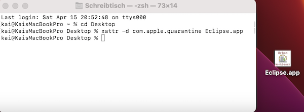

# Urban Workbench

Urban Workbench is a stand-alone application for integrating software for urban modeling, planning and simulation. The application is based on the Eclipse Rich Client Platfrom und available for all major operating systems.

The current proof of concept version comes with the following modules pre-installed:

* Urban Simulation Workflow Editor (also proof of concept for now)
* Read-only UI for Meteorological Data

Once installed, you can add more modules to the Workbench, e.g.:

* Parameter catalogs for Building Physics
* Parameter catalogs for Energy Systems
* [PyDev Python programming environment](https://www.pydev.org)
* [Java GIS Toolkit GeoTools](https://www.geotools.org)

### Installation

Download the application by clicking a link below that suits your operating system (64 bit Intel processor architecture only - AArch64 architecture for macOS and Linux are available on demand):

* [macOS (x86_64)](https://khbrassel.de/urbanworkbench/net.urbanworkbench.uw.product-macosx.cocoa.x86_64.tar.gz)
* [Windows (x86_64)](https://khbrassel.de/urbanworkbench/net.urbanworkbench.uw.product-win32.win32.x86_64.zip)
* [Linux (x86_64)](https://khbrassel.de/urbanworkbench/net.urbanworkbench.uw.product-linux.gtk.x86_64.tar.gz)

For Window/Linux:

* Extract the archive, e.g. to your desktop, and double click on `UW.exe` in the resulting folder.

For macOS:

* Extract the archive, e.g. to your desktop.
* Before starting the resulting `Eclipse.app` for the first time, start the terminal.app and execute `xattr -rd com.apple.quarantine <path to app>` to circumvent the rigid security measures of newer macOS versions like so:

When startet for the first time, the application will automatically create a directory named `UrbanWorkbenchWorkspace` in the users home directory. If you want to uninstall the app, please delete this directory as well as the extracted application (macOS) or application directory (Windows and Linux).

### First steps with the Urban Workflow Editor PoC

1. Once the workbench has started, find these buttons in the top toolbar:   
1. Click the green magic wand to to provide a name for a new project, e.g. `Test`
1. Click the blue button for creating a new workflow in the selected project with default name `NewWorkflow.urbansimworkflow`
1. In the appearing workflow editor, drag workflow steps from the palette into the editor and connect them with the `Successor` tool (see [user documentation on Sirius diagram editors](https://www.eclipse.org/sirius/doc/user/diagrams/Diagrams.html))
1. Click at a step to edit its properties in the property editor
1. When done click the orange "go" button to compile a python script from the workflow diagram. It will be added to the project (visible in the model explorer) and can be opened by right click on it and choose `Open With -> Text Editor`.
